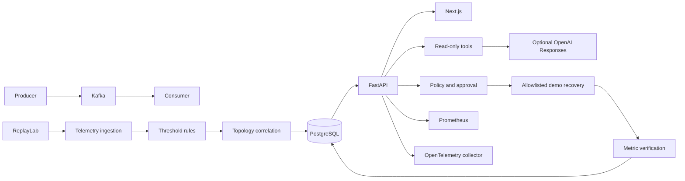

# InvestiNator architecture

The local demo has FastAPI, Next.js, PostgreSQL, a Kafka producer and consumer, Prometheus, and an OpenTelemetry collector. ReplayLab injects **simulated fault telemetry** through the metric and incident workflow. The Kafka workload itself is real; the injected broker fault is not.

SQLAlchemy tables hold incidents, alerts, telemetry, topology, approvals, audit events, replay runs, conversations, knowledge, AI usage, and evaluations. Alembic owns the schema. Data queries filter by the server-derived demo tenant. The client-supplied `tenant_id` on the compatibility endpoint is overridden. Production identity and tenant provisioning are absent.

The incident states include `investigating`, `resolved`, and `closed_unresolved` after a rejected demo action. Approval is a separate gate. Failed verification never closes an incident. The only write action simulates recovery for an active ReplayLab run; unknown action IDs and production commands are denied.

Telemetry observations and runbook suggestions have distinct source and kind fields. Deterministic rules create hypotheses only when evidence exists; otherwise they emit `insufficient_evidence`. The optional model receives bounded, redacted evidence and read-only tool results. A structured response must cite known evidence IDs. Model output never authorizes remediation. See [AI design](ai-design.md) and [security](security.md).

The stack does not connect to production Kafka, Spark, HDFS, NiFi, Kudu, a data catalog, or an enterprise identity system. The Kafka health adapter is read-only. Live platform adapters, real lineage discovery, OIDC/RBAC, retrieval indexing, and production runbook execution remain future work.
